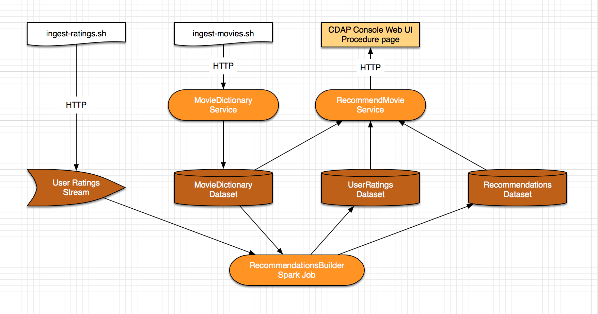
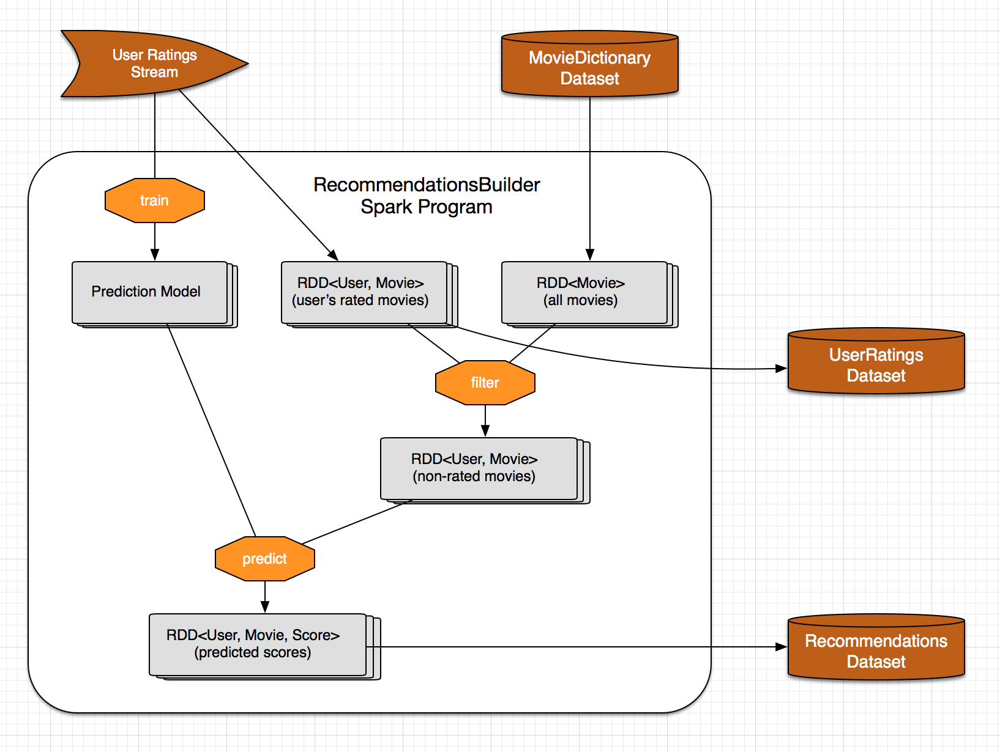

MovieRecommender
================

Overview
--------
The MovieRecommender application recommends movies to users using collaborative filtering.

* The ``ratings`` and ``movies`` data is taken from the `MovieLens Dataset <http://grouplens.org/datasets/movielens/>`_.
* The recommendation engine is based on the ALS (Alternating Least Square) implementation in Apache Spark MLlib library.

Implementation Details
----------------------

The MovieRecommender application is composed of the components:

* ``Streams`` for ingesting ``ratings`` data into the system
* A ``Service`` to store ``movies`` in a ``Dataset``
* A ``Service`` that recommends movies for a particular user
* A ``Spark`` Program which builds a recommendation model using the ALS algorithm and recommends
  movies for all the users

|(App)|

The ``RecommendationBuilder`` Spark program contains the core logic for building the movie
recommendations. It uses the ALS (Alternating Least Squares) algorithm from Apache Spark's MLlib
to train the prediction model.

|(RecommendationBuilder)| 

First, ``RecommendationBuilder`` reads the ``ratingsStream`` and uses it to train the prediction
model.  Then, it computes an RDD of not-rated movies using the ``movies`` dataset and the
``ratings`` dataset. It uses the prediction model to predict a score for each not-rated movie and
stores the top 20 highest scored movies for each user in the ``recommendations`` dataset.

